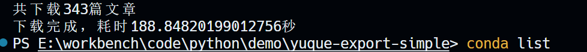

# yuque-export-simple
yuque-export

# 仅供学习使用
# 功能
- 🆒支持自定义 下载路径、错误重试次数、并发数等参数
- :100:可以导出您的所有知识库
- 👋保留您的知识库结构
- :baby_chick:导出的文件名与文档标题保持一致
# 下载实况

# 使用
```shell
git clone https://github.com/Agiantii/yuque-export-simple.git
```

```shell
cd yuque-export-simple
```

```
python -m venv .venv
```

```
.\.venv\Scripts\activate
```

```shell
pip install -r requirements.txt
```

配置 config.yaml 的cookie 和 target_dir

```shell
python main.py
```